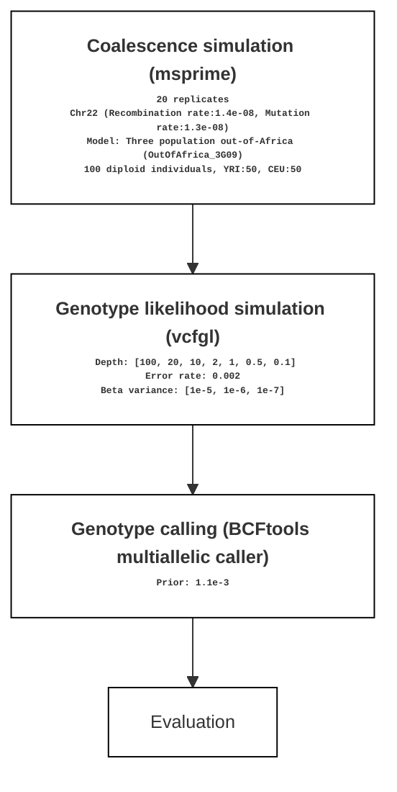

```mermaid
graph TD
A["<b>Coalescence simulation (msprime)</b>
<h1 style="font-size:5pt;font-family:monospace">20 replicates
Chr22 (Recombination rate:1.4e-08, Mutation rate:1.3e-08)
Model: Three population out-of-Africa (OutOfAfrica_3G09)
100 diploid individuals, YRI:50, CEU:50</h1>
"]
B["
<b>Genotype likelihood simulation (vcfgl)</b>
<h1 style="font-size:5pt;font-family:monospace"> Depth: [100, 20, 10, 2, 1, 0.5, 0.1]
Error rate: 0.002<br/>Beta variance: [1e-5, 1e-6, 1e-7]
</h1>
"]
C["<b>Genotype calling (BCFtools multiallelic caller)</b>
<h1 style="font-size:5pt;font-family:monospace">Prior: 1.1e-3
</h1>
"]
D[Evaluation]


A --> B 
B --> C
C --> D

%%D --- E1[Missingness rate]
%%D --- E2[Discordance rate]


classDef process fill:#FFFFFF,stroke:#000000,stroke-width:1px,font-size:13px;
classDef text fill:#FFFFFF,stroke:#FFFFFF,stroke-width:0px,font-size:13px;
class A,B,C,D process;
class E1,E2 text;
```
[//]:<>(
{
  "theme": "default",
  "fontFamily": "system-ui"
}
)
